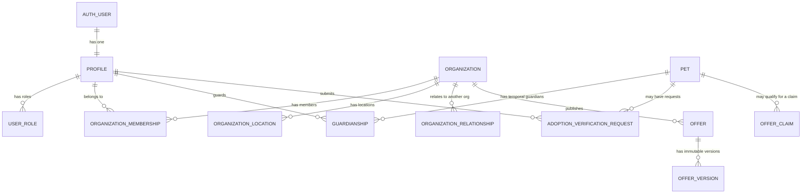

# MVP profile and data-model review

**Status:** Issue #9 decision checkpoint — September 8, 2026  
**Scope:** Code-grounded review of the QA branch at `e0eb9ef`; no product UI or database migration is introduced by this review.

## Decision summary

The existing model is a sound foundation for the MVP: one human identity can hold multiple roles, a pet is distinct from a guardian, organizations are separate from their members, and RAVE Vendor reuses the Partner organization and offer model. The current application should continue to collect the smallest useful set of fields, while Passport history, transfer, and shelter response remain controlled vertical slices rather than a large editable profile.

No migration is applied in this issue. The highest-risk gaps are authorization/workflow boundaries, not missing nullable columns. They must be addressed before the corresponding Phase 3 capability is activated.

## Current relationship model

`created_by` is provenance, not a durable ownership or organization-control grant. `guardianships` is the durable pet-access relationship; `organization_memberships` is the durable organization-control relationship.

## Field matrix

Classifications: **signup** = required to create an Auth account; **onboarding** = required to finish that persona's first usable path; **optional** = profile enrichment; **derived** = calculated/system/audit field; **schema now, UI later** = already appropriate for a later controlled slice; **not MVP** = retain only as future foundation, do not add to current forms.

### Human identity and roles

| Entity / fields                                                                     | Current mapping                                     | MVP classification | Notes                                                                                                            |
| ----------------------------------------------------------------------------------- | --------------------------------------------------- | ------------------ | ---------------------------------------------------------------------------------------------------------------- |
| Auth email, password or approved OAuth identity                                     | `auth.users`                                        | Signup             | Auth owns email; do **not** duplicate it in `profiles`. Email confirmation remains an Auth policy.               |
| Full name                                                                           | `profiles.full_name`, Auth user metadata            | Signup             | Required for a usable personal identity; trigger creates the profile.                                            |
| Phone, Instagram handle, avatar                                                     | `profiles.phone`, `instagram_handle`, `avatar_path` | Optional           | Personal contact/social data is private by default. Instagram is a link, not social login/media ingestion.       |
| Guardian, Shelter member/admin, Partner member/admin, Care provider, Platform admin | `user_roles` + `role_definitions`                   | Derived/system     | Authoritative role table, not user-editable metadata. `participant_roles` is legacy entry-context compatibility. |
| Address, personal demographics, emergency contact                                   | none                                                | Not MVP            | Do not collect without a specific product/use and sharing decision.                                              |

### Pet and guardianship

| Entity / fields                                                               | Current mapping                               | MVP classification                                  | Notes                                                                                                                                                                |
| ----------------------------------------------------------------------------- | --------------------------------------------- | --------------------------------------------------- | -------------------------------------------------------------------------------------------------------------------------------------------------------------------- |
| Name, species                                                                 | `pets.name`, `species`                        | Onboarding                                          | The only required Guardian Passport Lite fields today.                                                                                                               |
| Self-reported adopted flag                                                    | `pets.adopted_self_reported`                  | Onboarding when applicable                          | Must never unlock confirmed-adoption benefits.                                                                                                                       |
| Breed, birth date, approximate birth date, sex, altered status, weight, photo | `pets`                                        | Optional                                            | Use `birth_date` as the future canonical known date; `approximate_birth_date` is legacy compatibility. Do not demand health data to browse offers.                   |
| Pet identifiers / microchip / source identifiers                              | `pet_identifiers`, `pet_external_identifiers` | Schema now, UI later                                | Privacy-sensitive and useful for future shelter/provider transfer, but not needed in the current Guardian form.                                                      |
| `created_by`, demo, timestamps, onboarding submission id                      | `pets`                                        | Derived/system                                      | `created_by` records origin. It must not be treated as permanent authority after a transfer.                                                                         |
| Guardian, relationship, start/end, status                                     | `guardianships`                               | Onboarding for first Guardian; schema now for later | Supports multiple pets per Guardian and multiple Guardians per pet. `relationship` is currently `primary`/`co_guardian`; `status` and `ended_at` are temporal state. |
| Medical records, provider notes, daily-care detail, public sharing preference | none / future Passport records                | Not MVP                                             | Requires a provenance, consent, retention, correction, and selective-sharing design.                                                                                 |

### Shelter, Partner, and RAVE organization profile

| Entity / fields                                                                            | Current mapping                                       | MVP classification                     | Notes                                                                                                                                                 |
| ------------------------------------------------------------------------------------------ | ----------------------------------------------------- | -------------------------------------- | ----------------------------------------------------------------------------------------------------------------------------------------------------- |
| Public name, organization type, creator, status                                            | `organizations`                                       | Onboarding                             | Shelter uses submitted status; Partner creates a managed organization through the candidate/claim flow.                                               |
| Legal name, public description, website, public email/phone, Instagram, logo, service area | `organizations`                                       | Optional profile                       | Public fields must be consciously public. `organization_private_contacts` is preferred for operational contacts.                                      |
| Type code                                                                                  | `organizations.organization_type_code`                | Onboarding                             | Use `organization_type_code` as the extensible taxonomy. Legacy `organization_type` enum remains compatibility data and should not gain new behavior. |
| RAVE Vendor channel                                                                        | Partner role + organization + `offers.channel='rave'` | Onboarding classification              | RAVE Vendor is not a duplicate identity model. Its offers use the RAVE channel; a business may hold both PetBiz and RAVE participation.               |
| Locations, categories, business hours, social links, Partner public profile                | organization child tables                             | Optional profile / required to publish | Profile publication requires public description, public contact path, and location context or online/service model.                                   |
| Private primary and operations/redemption contacts                                         | `organization_private_contacts`                       | Optional profile                       | Owner/admin access only. Do not surface via public profile RPCs.                                                                                      |
| Verification, nonprofit registration, tax IDs, payment details                             | `verified_at` / none                                  | Schema now only for status; UI later   | Registration, membership, publication, and verification remain separate. Do not request tax/payment information in MVP profiles.                      |

### Organization membership and relationships

| Entity / fields                                       | Current mapping                                           | MVP classification                                | Notes                                                                                                                                             |
| ----------------------------------------------------- | --------------------------------------------------------- | ------------------------------------------------- | ------------------------------------------------------------------------------------------------------------------------------------------------- |
| Member user, role, membership status                  | `organization_memberships`                                | Onboarding for initial owner; schema now for team | Only active owner/admin/publisher roles confer scoped control. Invites/team management remain later UI.                                           |
| Parent organization                                   | `organizations.parent_organization_id`                    | Schema now, UI later                              | Structural hierarchy only; never grants child/parent cross-access automatically.                                                                  |
| Typed organization relationship, status, dates, notes | `organization_relationships`                              | Schema now, UI later                              | Supports franchise, affiliate, preferred-vendor, sponsor, and community relationships without conflating ownership.                               |
| Legacy connections                                    | `organization_connections`                                | Not MVP for new work                              | Older simple connection model overlaps typed relationships. Do not build new UI on it; migrate deliberately only if legacy data needs it.         |
| Ownership/duplicate/access-request workflow           | onboarding drafts/candidates/access requests/review cases | Onboarding for Partner; schema now for Shelter    | Partner has an atomic candidate/claim flow. Shelter must reuse equivalent duplicate/claim protection before broad shelter onboarding is promoted. |

### Offers and Marketplace

| Entity / fields                                                                          | Current mapping                               | MVP classification                                            | Notes                                                                                                                                                  |
| ---------------------------------------------------------------------------------------- | --------------------------------------------- | ------------------------------------------------------------- | ------------------------------------------------------------------------------------------------------------------------------------------------------ |
| Partner organization, channel, title, summary, category, classification                  | `offers`                                      | Onboarding for first offer; required to publish               | Channel distinguishes pet, RAVE, and shared experiences. Classification never self-confers exclusive, sponsor, affiliate, or adoption-verified status. |
| Terms, dates, eligibility, claim limits, redemption instructions, source URL, disclosure | `offer_versions`, eligibility/location tables | Required to publish                                           | Versioned terms are authoritative; do not rewrite historical offers.                                                                                   |
| Current version, status, publication/suspension dates, audit events                      | `offers`, private audit                       | Derived/system                                                | Public reads use allowlisted active-version RPCs.                                                                                                      |
| Claims/redemptions/economic and giving records                                           | claim/redemption/ledger tables                | Schema now, UI later except approved Partner checkpoint flows | Keep claim, utilization, savings, and giving separate. No customer-facing "verified savings" total until evidence rules are approved.                  |

### Adoption / shelter verification

| Entity / fields                                                                                                                  | Current mapping                  | MVP classification                               | Notes                                                                                                                             |
| -------------------------------------------------------------------------------------------------------------------------------- | -------------------------------- | ------------------------------------------------ | --------------------------------------------------------------------------------------------------------------------------------- |
| Shelter name and one contact route                                                                                               | `adoption_verification_requests` | Onboarding when Guardian elects verification     | Existing RPC requires shelter name plus email, phone, or website/social.                                                          |
| Adoption date estimate and pet name at adoption                                                                                  | request fields                   | Optional during onboarding                       | Valuable matching context; absence must not prevent a request.                                                                    |
| Guardian matching details                                                                                                        | `guardian_match_details`         | Optional during onboarding — **UI missing**      | Existing schema field is not currently captured by the Guardian form. Add only when the confirmation vertical slice is activated. |
| Contact consent timestamp                                                                                                        | `contact_consent_at`             | Required during adoption-verification onboarding | Server, not browser copy alone, records the timestamp.                                                                            |
| Delivery state, token digest, expiry, views, response, reminders                                                                 | request fields                   | Derived/system                                   | Token digest belongs in a private or restricted flow; no raw token is stored in ordinary rows.                                    |
| Responder name/role/notes, confirmed adoption date, evidence path                                                                | request fields                   | Schema now, UI later                             | Single evidence path is enough for a first narrow flow; do not expand to clinical document management now.                        |
| Linked verified shelter organization / responder account, delivery provider message IDs, structured report card, medical history | none / partial                   | Future field — design before Phase 3             | Needed for stronger provenance and support operations, but must not be improvised in a Guardian form.                             |

## Findings and required gates

### Foundation is usable now

- Multiple pets work through active `guardianships`; the Guardian dashboard already reads all active pet relationships.
- The same person can hold several roles without creating several accounts.
- Partner and RAVE offers share one immutable/versioned offer architecture.
- Organizations support locations, memberships, a structural parent, and typed relationships without automatic access inheritance.
- RLS is enabled across public business tables; private audit and opaque tokens are not browser-readable.

### Do before activating the corresponding vertical slice

| Priority                                             | Gap / risk                                                                                                                                              | Required correction                                                                                                                                                    |
| ---------------------------------------------------- | ------------------------------------------------------------------------------------------------------------------------------------------------------- | ---------------------------------------------------------------------------------------------------------------------------------------------------------------------- |
| Must fix before shelter-created Passport or transfer | `pets.created_by` still grants read/update access in current RLS. A former creator could retain access after guardianship changes.                      | Replace creator-based ongoing pet authority with a transactional, audited lifecycle/guardianship policy and transfer command. Keep `created_by` as provenance only.    |
| Must fix before co-guardian UI                       | More than one active `primary` guardianship is currently possible.                                                                                      | Add an explicit primary-controller rule/constraint and a carefully defined invitation/acceptance workflow. Do not infer shared access from a relationship label alone. |
| Must fix before sending adoption emails              | Existing request row has no linked responder organization/account or delivery-provider event model; raw delivery should not be implied by status alone. | Implement a dedicated server-side request/send/respond workflow with private tokens, audit, rate limits, 30-day expiry/reminders, and restricted document storage.     |
| Must fix before shelter self-service grows           | Shelter onboarding currently directly creates its organization and does not reuse Partner duplicate/claim control.                                      | Reuse or generalize the organization candidate/access-request command; never allow duplicate claims to become implicit control.                                        |
| Must fix before profile editing expands              | Guardian form does not edit profile phone/Instagram, and it collects only name/species for pets.                                                        | Add focused profile editing as a later small slice; do not conflate it with Passport history or medical data.                                                          |

### Redundancy and normalization decisions

- `participant_roles` and `user_roles` overlap. `user_roles` is the authorization source; keep `participant_roles` only as legacy signup-context compatibility until a deliberate migration/removal plan exists.
- `organizations.organization_type` enum and `organization_type_code` overlap. Use the code for new extensible behavior; preserve the enum for current compatibility.
- `pets.approximate_birth_date` and `birth_date` overlap. Future UI must label known versus estimated dates and write only the appropriate canonical field.
- `organizations.parent_organization_id`, `organization_relationships`, and legacy `organization_connections` overlap. Use parent only for structural hierarchy and typed relationships for business associations; do not add new connection UI.
- `guardianships.status` plus `ended_at` duplicate temporal signals. Active access must require both `status='active'` and `ended_at is null` until a migration formally consolidates the state model.

## Privacy and RLS boundary

- A public Partner/RAVE directory can expose only allowlisted public organization/profile/offer data. Private contacts, draft offers, claims, redemptions, evidence, identifiers, and audit events are not directory data.
- Guardian pet information is private. A Partner relationship, offer claim, or organization connection does not grant Passport access.
- Adoption verification confirms a limited adoption fact. It does not establish a verified shelter admin, an unrestricted shelter-Passport permission, or a medical authority.
- Any new `SECURITY DEFINER` command must authorize with `auth.uid()`/authoritative membership inside the function, revoke default `PUBLIC` execution, and receive focused RLS/negative tests. Existing advisor warnings for intentionally callable guarded commands need individual review—not blanket suppression.
- Support/admin workflows need append-only audit facts and targeted administrative views/RPCs; platform staff should not receive blanket table access by default.

## MVP boundary and recommended implementation order

1. **Complete Partner Marketplace vertical slice**: profile publication, offers, claims/redemptions, targeted golden-path tests, and moderation/support visibility.
2. **Guardian profile-lite slice**: private contact/profile editing plus multiple-pet list/detail, without medical history or transfers.
3. **Adoption verification slice**: guardian request, private token/email workflow, responder page, 30-day reminders, outcome/audit, and narrow document handling.
4. **Shelter-origin + handoff foundation**: transactional shelter-created pet, lifecycle event, secure guardian claim, and authority transfer. This is the prerequisite for shelter-created Passports—not a profile-form enhancement.
5. **Passport history and controlled sharing**: provenance-aware facts/documents, co-guardian policy, provider contribution, and selective sharing only after explicit product decisions.

## Product-owner decisions needed before the relevant slice

1. Who is the primary controller when a pet has co-guardians, and what actions require their approval?
2. What evidence is sufficient for disputed adoption verification or a contested transfer, and who resolves it?
3. Should a shelter responder be able to link a verification to an existing shelter organization immediately, or only after organization verification?
4. Which specific Guardian contact fields are necessary for support versus optional private profile enrichment?
5. What is the minimum public Shelter profile and publication/review rule before shelters are searchable?

## Testing strategy

Keep the existing Phase 1/2 RLS and targeted persona regressions. The next data-changing slice must add only its own golden-path and negative tests:

- adoption request: guardian can create/read own request; no other guardian can read it;
- responder token: valid once, expired/revoked denied, no unrelated pet/account access;
- transfer: failed/reused claim leaves guardianship unchanged; former authority loses current private access;
- organization claim: member/parent/relationship does not create unauthorized control.

Do not expand the broad Issue #5 suite as part of this planning checkpoint.
