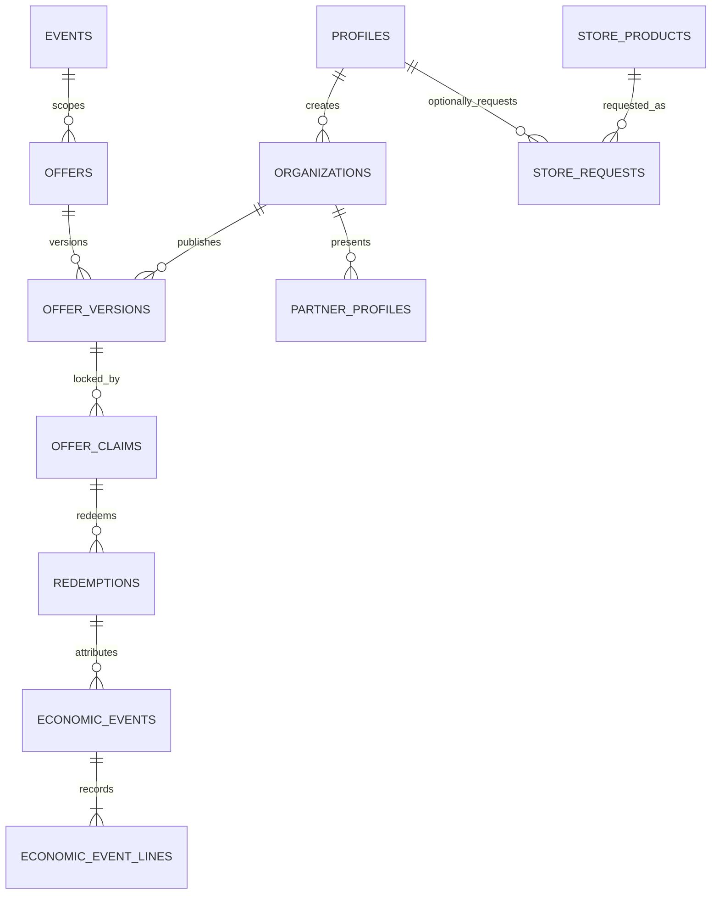

# Master Data Architecture

Status: initial architecture baseline for Issues #252/#253. PostgreSQL/Supabase
is the operational source of truth; analytics projections must derive from it.

## Domain model

## Canonical data and governance

| Concept                          | Source of truth                                              | Class                   | Rule                                                               |
| -------------------------------- | ------------------------------------------------------------ | ----------------------- | ------------------------------------------------------------------ |
| Person/account                   | `profiles`, auth user                                        | master/PII              | UUID identity; least-access RLS                                    |
| Organization and membership      | `organizations`, `organization_memberships`                  | master                  | membership controls management, not name matching                  |
| Offer identity/current lifecycle | `offers`                                                     | versioned shell         | stable offer ID; state never replaces historical terms             |
| Offer terms                      | `offer_versions`                                             | immutable/versioned     | revise creates a new version                                       |
| Claim/redemption                 | `offer_claims`, `redemptions`                                | transaction             | claim retains exact offer-version attribution                      |
| Monetary impact                  | `economic_events`, `economic_event_lines`                    | append-only fact        | integer minor units; corrections/reversals, never in-place rewrite |
| Partner public profile           | `organization_partner_profiles` plus controlled child tables | master/published config | publication is separate from private contacts                      |
| Events/attendance                | `events`, `event_attendance`                                 | master/fact             | event is campaign scope, not an offer substitute                   |
| Swag catalog                     | `store_products`                                             | master/published config | platform-admin owned; active rows public                           |
| Swag request                     | `store_requests`                                             | transaction             | product FK and request-time product/price snapshot                 |
| Audit/provenance                 | `private.audit_events` and version/audit tables              | protected audit         | no browser-public reads; preserve actor/time/source                |

Controlled taxonomies (role, organization kind, offer audience/channel,
category, publication/status) must use constrained relational values or
explicit approved vocabularies. Deprecate values; do not silently repurpose or
free-text-merge reporting keys.

## Lifecycles

| Workflow        | Allowed lifecycle                                         | Historical rule                                                                  |
| --------------- | --------------------------------------------------------- | -------------------------------------------------------------------------------- |
| Offer           | draft → published/scheduled → paused/resumed → archived   | revisions create `offer_versions`; public reads only publishable current version |
| Claim           | created → eligible/claimed → redeemed/expired/cancelled   | retain claim's version and eligibility evidence                                  |
| Redemption      | initiated → completed; correction/reversal is append-only | never overwrite completed economic history                                       |
| Swag request    | new → contacted → fulfilled or closed                     | snapshot product slug, price, currency, variant/size at creation                 |
| Partner profile | draft → published → unpublished/suspended/removed         | public read follows publication state; private data remains private              |

## RLS/persona matrix

| Persona        | Public catalog            | Request                                    | Own private data              | Partner content                   | Admin data                 |
| -------------- | ------------------------- | ------------------------------------------ | ----------------------------- | --------------------------------- | -------------------------- |
| Anon           | active products/read-only | submit only through `create_store_request` | none                          | published only                    | none                       |
| Guardian       | active products           | submit; no request-list read               | own profile/pets/claims       | published only                    | none                       |
| Partner        | active products           | submit; no request-list read               | own membership/profile/offers | own authorized organization paths | none                       |
| Platform admin | all catalog and requests  | manage lifecycle                           | administrative scope          | manage publication                | protected audit per policy |

No public delete for Swag requests. Browser input is untrusted; privileged
state transitions require RLS/RPC boundaries.

## Reporting metric catalog

| Metric            | Grain              | Numerator / denominator                      | Canonical sources                         | Caveat                                   |
| ----------------- | ------------------ | -------------------------------------------- | ----------------------------------------- | ---------------------------------------- |
| Active offers     | offer/version/day  | publishable current versions                 | `offers`, `offer_versions`                | define scheduled boundary explicitly     |
| Claim rate        | offer version/time | claims / eligible impressions (when tracked) | `offer_claims`, future impressions        | no impression denominator yet            |
| Redemption rate   | offer version/time | completed redemptions / eligible claims      | `redemptions`, `offer_claims`             | exclude cancelled/expired by stated rule |
| Savings delivered | economic line      | sum signed minor-unit value                  | `economic_events`, `economic_event_lines` | corrections remain separate lines        |
| Event performance | event/time         | claims/redemptions/impact by event           | events + offer/claim/redemption IDs       | no free-text event join                  |
| Swag fulfillment  | product/time       | fulfilled requests / new requests            | `store_requests`                          | request is not payment/order conversion  |

## Retention and change rules

Keep business-significant offers, versions, claims, redemptions, economic
events, verification decisions, request snapshots, and audit events. Archive
or deactivate public configuration instead of hard deleting it. PII is
minimized; account deletion/anonymization must preserve legally necessary
non-identifying transaction/audit provenance. Schema changes are additive,
migration-only, and FK/check/unique constraints enforce integrity at the DB.

## Gap analysis and sequencing

### Launch P0/P1

- `store_requests`: complete RPC-only public creation, product/price/variant
  snapshot, lifecycle timestamps, admin-management surface, pgTAP and browser
  regression.
- Partner profile: audit current multi-call delete/reinsert save; replace with
  one transaction/RPC if partial failure is reproducible.
- Prove write → reload → public-read parity for launch-critical Offer,
  Partner Profile, Event, Guardian, and Swag workflows.

### Post-launch hardening

- Store product variants and immutable price-history table.
- Explicit reporting views/materialized views after metric definitions settle.
- Controlled relational taxonomy tables where current validated vocabularies
  become insufficient; deprecation/merge mappings, never destructive rewrite.
- Formal retention schedules and privacy-reviewed anonymization jobs.

This baseline intentionally preserves the existing strong foundations:
immutable offer versions, version-bound claims, redemption history,
`economic_events`/`economic_event_lines`, append-only corrections/reversals,
and protected audit data.
